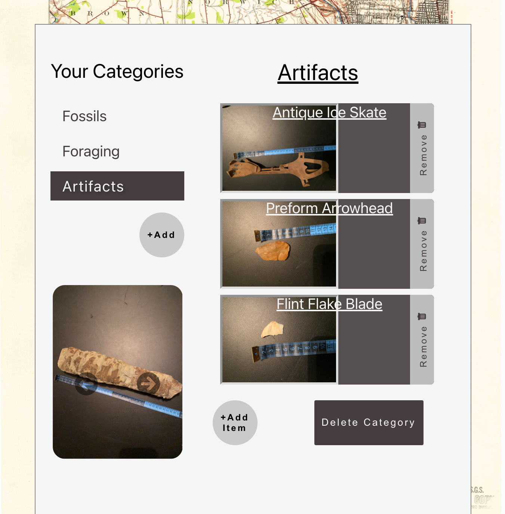
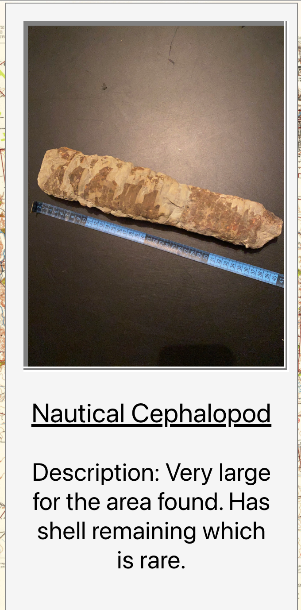

# Pick-It-Up API

Client Repo: https://github.com/blakeifitz/pick-it-up-client
Live App: https://github.com/blakeifitz/pick-it-up-client

This app was created to keep track of a users finds when they are out hunting.

A lot of my hobbies include going to different places to find a variety of items. I like to metal detect, arrowhead hunt, mushroom hunt, and fossil hunting. Over the years I have collected
lots of items. Over time I forget exactly where I found things or what stratigraphic age they are. With this app a user can save details about items, the location they were found, and the category of item they are. A user can choose to add to previous locations or add a new one using a React Leaflet Map. A user can save a photo, notes, and a location for each item. There is a list of all a user's items. Those items can be clicked on to see a detailed view with item and location info. A user can view stratigraphic data for the coordinates of their locations. I used Macrostrat API ( https://macrostrat.org/ ) to accomplish this.

| Method |     Path      |                                   Usage |
| :----- | :-----------: | --------------------------------------: |
| POST   |   /api/user   |                       User registration |
| POST   |   /api/auth   | Manages authorization and authenication |
| GET    | /api/category |                 Get all user categories |
| POST   | /api/category |                Adds a category for user |
| GET    | /api/category |                 Get all user categories |
| DELETE | /api/category |                  Deletes category by Id |
| POST   | /api/location |                   Add location for user |
| GET    | /api/location |                  Get all user locations |
| DELETE | /api/location |                  Deletes location by Id |
| POST   |   /api/item   |                       Add item for user |
| GET    |   /api/item   |                      Get all user items |
| DELETE |   /api/item   |                      Deletes item by Id |

### This app was created with:

